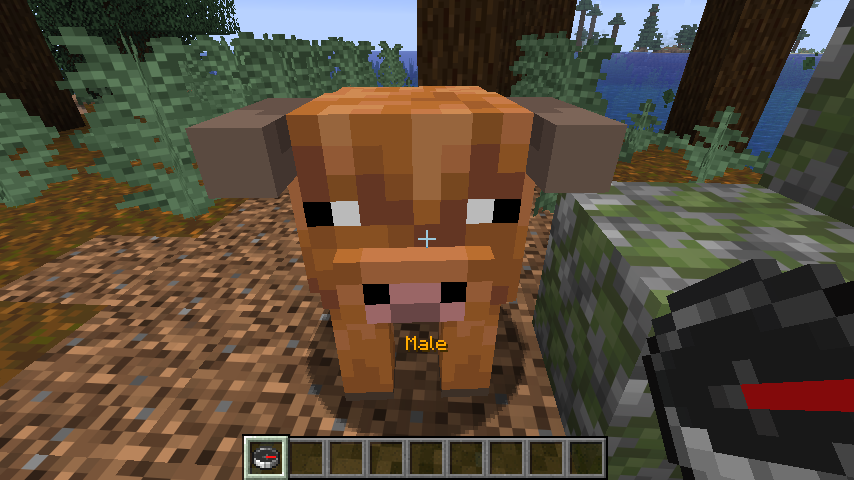
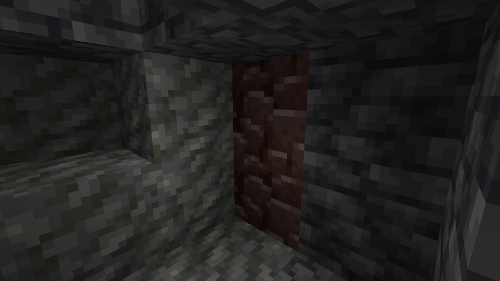
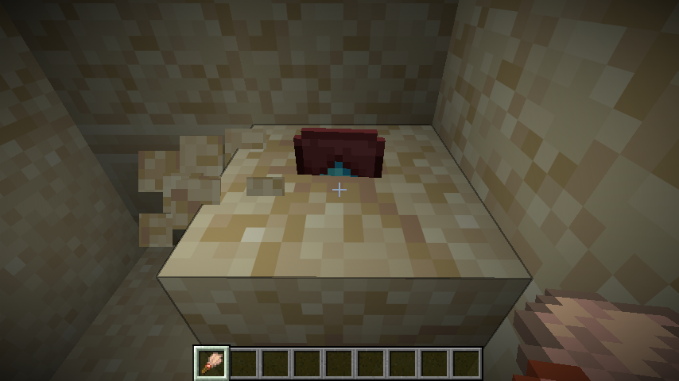
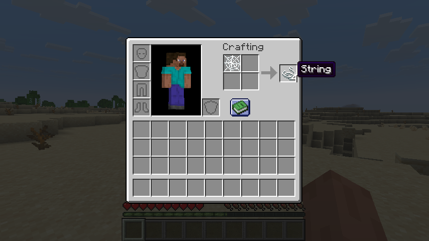

# 🧹 Cleaned Minecraft

**Strip away the chaos, keep the challenge.**

A Fabric mod that redefines vanilla survival by removing hostile elements while adding new exploration and resource mechanics. Perfect for players who love minimalistic building and adventure but don't want the game to have battles and magic.

---

## 🛠️ Technical Details
- **Minecraft version:** `26.2` (currently latest stable release)
- **Fabric API:** `0.154.1+26.2`
- **Mod Loader:** [Fabric](https://fabricmc.net/)
---

## ✨ What's Changed

### ❌ Removed Content
| Category | What's Gone |
| :--- | :--- |
| **Hostile Mobs** | Creepers, zombies, skeletons, and all other aggressive creatures |
| **Dimension** | The Nether — portals no longer function |
| **Weapons** | Swords, bow, crossbow, mace |
| **Enchanting** | Enchanting table, enchanted books, anvil enchanting |
| **Potion brewing** | Brewing stand, potions |

### ➕ New Additions
| Feature | Description |
| :--- | :--- |
| **🐄 Gender System** | Animals and villagers now have male and female variants. **Right-click** any creature with a **compass** to check its gender. |
| **💎 Ancient Debris** | Now found in the **Overworld**! Mine it in hot biomes (Desert, Badlands, Savanna) at **Y: -40 to -60**. |
| **⬆️ Netherite Upgrade** | The Netherite Upgrade Template can be found via **archaeology** in **suspicious sand** inside Desert Pyramids. Use it to upgrade **tools** (pickaxe, axe, shovel, hoe). |
| **🕷️ String Crafting** | Craft **4 string** from 1 cobweb. |

### 🕊️ Peaceful Mobs
The following mobs are now completely **neutral and peaceful**:
- **🕷️ Spiders** — no longer attack at night or in darkness. They just roam around.
- **🐻 Polar Bears** — now passive and won't attack when approached.
- **🪨 Silverfish** — no longer attack players.

---

## 📸 Features Preview

| Feature | Screenshot |
| :--- | :--- |
| **Gender Display** (right-click with compass) |  |
| **Ancient Debris** in hot biomes |  |
| **Netherite Template** from Desert Pyramid archaeology |  |
| **String** from cobweb |  |

---

## ⚙️ Installation

1. Install **Fabric Loader** for Minecraft `26.2`.
2. Download **Fabric API** `0.154.1+26.2` and place it in your `mods` folder.
3. Place this mod's `.jar` file in the same folder.
4. Launch the game and enjoy!

---

## 🎯 Why This Mod?

This mod shifts the focus to **exploration and survival**. Nights are no longer terrifying, but obtaining Netherite gear now requires you to brave the deepest deserts and excavate ancient pyramids. It's a cleaner, more peaceful Minecraft — but still rewarding.

---

## 📜 License

This project is licensed under the **MIT License** — you're free to use, modify, and distribute it for any purpose, provided you include the original copyright notice.

---

## 🏷️ Disclaimer

Minecraft is a trademark of Mojang AB. This mod is not affiliated with, endorsed by, or sponsored by Mojang or Microsoft. All rights to the original game belong to their respective owners.